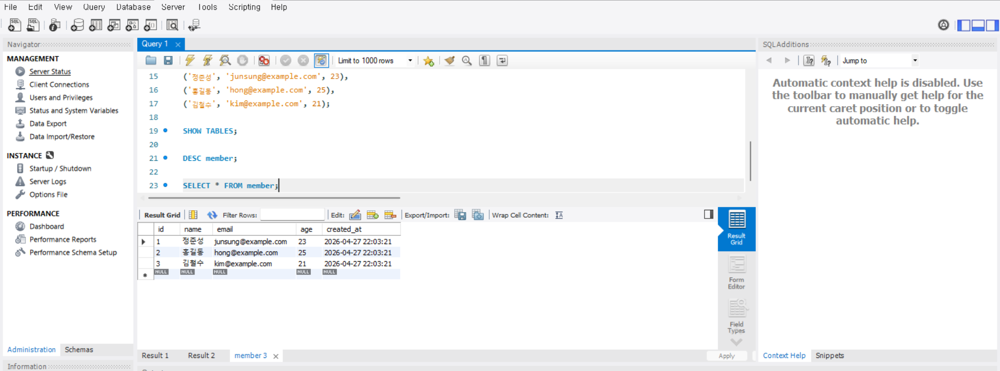

# DB 준비 과정

## 1. 데이터베이스 생성

```sql
CREATE DATABASE umc_10th;
USE umc_10th;
```

## 2. 테이블 생성

```sql
CREATE TABLE member (
    id BIGINT AUTO_INCREMENT PRIMARY KEY,
    name VARCHAR(50) NOT NULL,
    email VARCHAR(100) NOT NULL UNIQUE,
    age INT,
    created_at TIMESTAMP DEFAULT CURRENT_TIMESTAMP
);
```

## 3. 데이터 삽입

```sql
INSERT INTO member (name, email, age)
VALUES
('정준성', 'junsung@example.com', 23),
('홍길동', 'hong@example.com', 25),
('김철수', 'kim@example.com', 21);
```

## 4. 테이블 생성 확인

```sql
SHOW TABLES;
DESC member;
SELECT * FROM member;
```

## 5. 실행 결과 캡처

아래 이미지는 로컬 MySQL에서 실제로 DB와 테이블을 생성하고 확인한 화면입니다.

